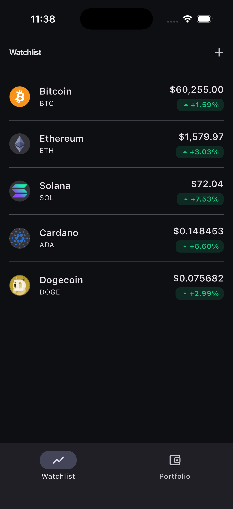
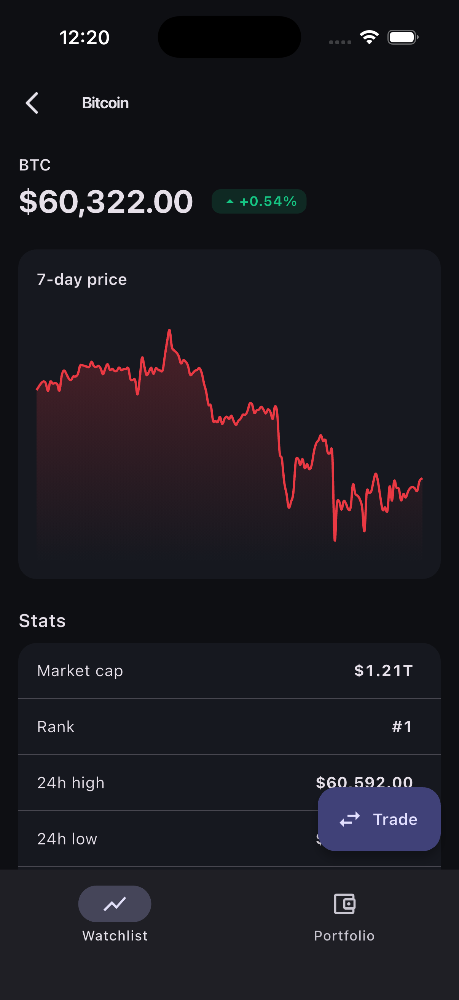
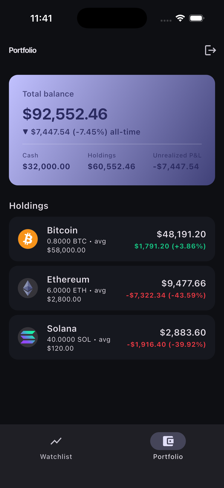
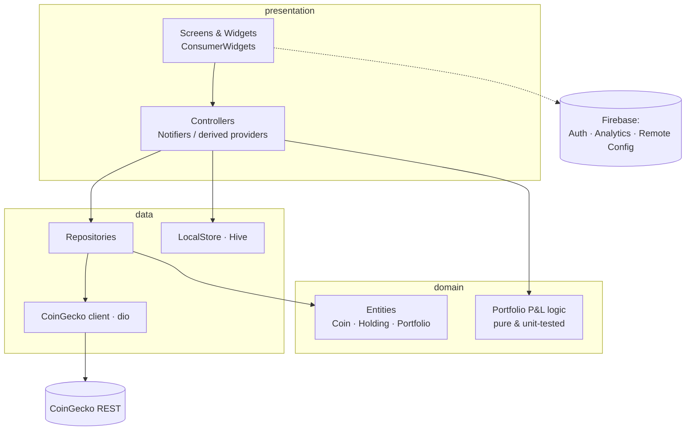
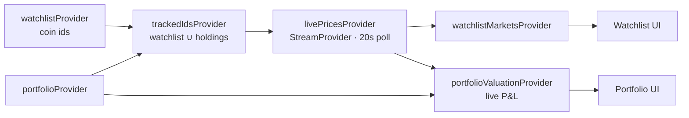

# Tickr

**A paper-trading crypto watchlist & portfolio, built with Flutter.**
Browse and search crypto, track live prices and 7-day charts, and "paper trade"
with a $100k virtual balance to watch your holdings and **P&L update in real time**.

[](https://github.com/pvlah/tickr/actions/workflows/ci.yml)
&nbsp;
&nbsp;
&nbsp;

### ▶️ [**Live demo →** tickr-30dc8.web.app](https://tickr-30dc8.web.app)
_Runs in the browser. The public demo skips sign-in and seeds a sample
portfolio so you can explore immediately; prices are live from CoinGecko._

---

## Features

- **Auth** — Firebase Anonymous ("Continue as guest") + email/password, with an
  auth-gated router.
- **Watchlist** — search/add/remove coins; **live price + 24h change** that
  re-polls on a timer; swipe to remove.
- **Coin detail** — a 7-day `fl_chart` price chart (trend-colored) + key stats.
- **Paper portfolio** — $100k starting cash, buy/sell with validation, holdings
  with **live unrealized P&L** that recomputes on every price tick and trade.
- **Reactive everywhere** — prices stream in via Dart `Stream`s; the watchlist
  and the portfolio's net worth both derive from one shared live-price feed.
- **Design system** — design tokens (color/spacing/type), Material 3 dark theme,
  a `MarketColors` theme extension for gain/loss, and reusable
  loading / empty / error states.
- **Persistence** — portfolio + watchlist survive restarts (Hive).
- **Analytics & A/B test** — Firebase Analytics events + a Remote Config
  experiment that swaps the watchlist layout (list vs. cards).
- **Tested + CI** — unit tests for the P&L math, widget + golden tests, and a
  GitHub Actions pipeline (format → analyze → test → web build).

## Screenshots

| Watchlist (live prices) | Coin detail + chart | Portfolio (live P&L) |
| --- | --- | --- |
|  |  |  |

## Architecture

Tickr uses a **clean, layered architecture**. Dependencies point inward —
`presentation` and `data` depend on `domain`; `domain` depends on nothing.



**Reactive data flow (the core idea):**



A single `livePricesProvider` polls CoinGecko for the *union* of watchlisted and
held coins. Both the watchlist and the portfolio valuation **derive** from it, so
there's one source of truth and one network cadence — and the UI updates on
every tick with no manual wiring.

## Tech stack — and why

Each choice maps to a real requirement for a Flutter mobile-engineering role.

| Area | Choice | Why |
| --- | --- | --- |
| Language / UI | **Flutter + Dart** | Cross-platform (iOS + Android + web) from one codebase. |
| State management | **Riverpod** (`flutter_riverpod`) | Compile-safe DI + reactive providers; trivially testable via overrides. |
| Reactive updates | **Dart `Stream` / `StreamProvider`** | Live prices are *many values over time* — a Stream, polled with `Timer.periodic` and cleaned up via `ref.onDispose`. |
| Networking | **dio** | Configurable REST client (timeouts, interceptable, 429 handling). |
| Charts | **fl_chart** | The 7-day price line chart. |
| Navigation | **go_router** | Declarative routing, nested shell routes for the bottom nav, and an auth `redirect`. |
| Backend | **Firebase** | Auth, Analytics, and Remote Config (A/B test). |
| Local persistence | **Hive** | Portfolio + watchlist survive restarts (web: IndexedDB, mobile: files). |
| Formatting | **intl** | Locale-aware currency/percent formatting. |
| Tests | **flutter_test** | Unit (P&L), widget, and golden tests. |
| CI/CD | **GitHub Actions** | format → analyze → test → web build on every push. |

Data comes from the **free CoinGecko REST API** (no key). A 15-second TTL cache in
the repository keeps us within the free-tier rate limit.

## Project structure

```
lib/src/
  core/         cross-cutting: theme & design tokens, router, auth,
                analytics, remote config, shared widgets, formatters
  data/         CoinGecko client (dio), DTOs, repositories, Hive persistence
  domain/       entities (Coin, Holding, Portfolio) + pure P&L logic
  presentation/ feature screens + Riverpod controllers
                (watchlist, detail, portfolio, auth, markets)
  demo/         compile-time demo mode for the public web build
```

## Getting started

```bash
git clone https://github.com/pvlah/tickr.git
cd tickr
flutter pub get
flutter run -d chrome        # web — no Xcode/Android setup needed
```

Run the **demo variant** (skips sign-in, seeds a portfolio):

```bash
flutter run -d chrome --dart-define=TICKR_DEMO=true
```

> Firebase is already configured (`lib/firebase_options.dart` is committed), so
> the app builds and runs out of the box. To point it at your own Firebase
> project, run `flutterfire configure`.

## Testing

```bash
flutter test                       # everything (incl. golden)
flutter test --exclude-tags golden # what CI runs (goldens are platform-sensitive)
flutter test --update-goldens      # regenerate golden images
```

- **Unit** — `test/domain/portfolio_test.dart`: buy/sell, weighted-average cost
  basis, validation, and live-valuation P&L math.
- **Widget** — boots the app to the watchlist; performs a buy and asserts the
  portfolio renders live P&L.
- **Golden** — pixel snapshot of the `ChangeBadge` gain/loss variants.

CI runs format check + analyze + tests + a web build on every push to `main`.

## Notes & roadmap

- Persistence is local (Hive) today; the Firestore dependency is wired and ready
  to back the portfolio/watchlist with proper security rules.
- iOS/Android builds: `flutter build ios` / `flutter build apk` (iOS needs Xcode
  + CocoaPods set up locally).

## License

MIT — see [LICENSE](LICENSE).
